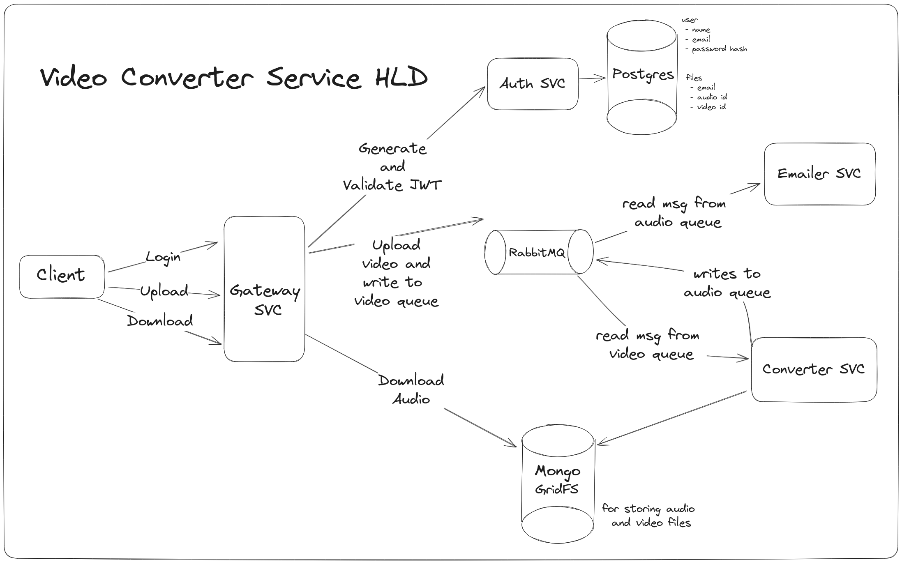

# Video Converter Service

 

 
 

- A toy video to audio converter in microservice architecture deployed using
[Kubernetes](about:blank)
- All services are written in python.
- Uses [Postgres](https://www.postgresql.org/) for data storage,
[MongoDB GridFS](https://www.mongodb.com/docs/manual/core/gridfs/) for media storage 
and [RabbitMQ](https://www.rabbitmq.com/) as a
queue between different services

## Overview

### Auth Service
- For creating user
- Generating and validating JWT token

### Converter Service
- Reads new convert requests from rabbit mq and stores audios in MongoDB after converting using [ffmpeg](https://pypi.org/project/moviepy/).

### RabbitMQ
- Main motive of using rabbit mq here is to make the whole service async in nature
as converting is a time taking process, blocking user request till conversion finishes which not a good experience
- So instead of this, we add new conversion request in a `video` queue and return some sort of
acknowledgement to user immediately and later read requests from queue and process those
after processing we add event in `audio` queue which will be consumed by emailer service

### Emailer Service
This service sends a email notification to user as soon as their request is completed
by reading completed events from `audio` queue

### Gateway Service
- User facing entry point of the service
- Exposes api: 
  - `POST /login`
  - `POST /signup`
  - `POST /upload`
  - `GET /download?fid='videoid'`

## High Level Diagram
 
